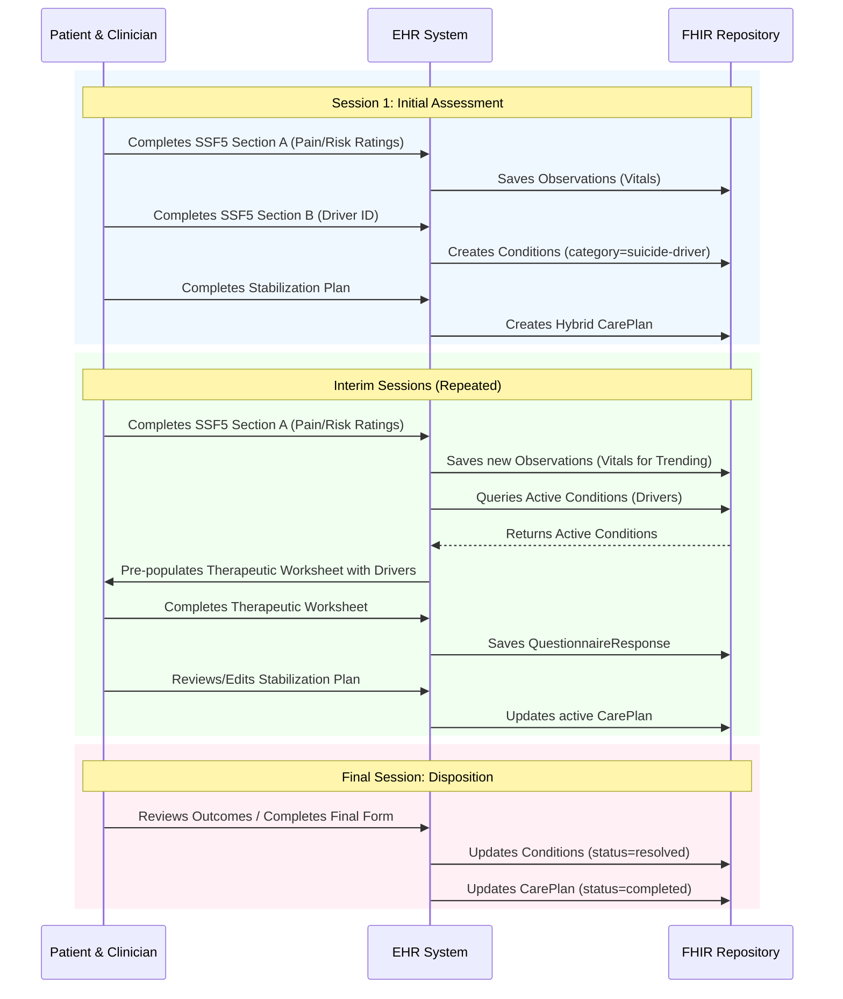

# CAMS Data Flow & Implementation Guide

This document defines the "wiring" between the various CAMS FHIR artifacts. It explains how data captured in one form (Questionnaire) is persisted and re-used in subsequent steps of the clinical workflow.

## 1. The "Driver" Lifecycle (Problem Tracking)
The core of CAMS is identifying and treating specific "Drivers" (problems) that cause suicidality.

### Step 1: Identification (Session 1)
*   **Source:** `CAMS_SSF5_SectionB_Questionnaire.json`
*   **Fields:**
    *   `driver-1-desc` (Description)
    *   `driver-1-type` (Direct vs Indirect)
*   **Action:** The EHR backend MUST extract these answers and create **FHIR Condition** resources.
    *   `Condition.code.text` = `driver-1-desc`
    *   `Condition.category` = `suicide-driver` (System: `http://cams-care.com/driver-category`)
    *   `Condition.clinicalStatus` = `active`

### Step 2: Exploration (Interim Sessions)
*   **Source:** `Condition` resources (Query: `category=suicide-driver&status=active`)
*   **Target:** `CAMS_Therapeutic_Worksheet_Questionnaire.json`
*   **Logic:** The EHR should **pre-populate** the worksheet headers ("Problem #2", "Problem #3") with the titles of the active drivers identified in Session 1.

### Step 3: Resolution (Final Session)
*   **Action:** When a driver is no longer relevant, the clinician marks it as "Resolved" in the SSF Outcome form (to be built), updating the `Condition.clinicalStatus` to `resolved`.

## 2. Core Assessment Scoring (The "CAMS Vitals")
The patient rates 5 key markers (1-5 scale) at the start of *every* session.

*   **Source:** `CAMS_SSF5_SectionA_Questionnaire.json`
*   **Fields:**
    *   `1-score` (Psychological Pain)
    *   `2-score` (Stress)
    *   `3-score` (Agitation)
    *   `4-score` (Hopelessness)
    *   `5-score` (Self-Hate)
    *   `6-score` (Overall Risk)
*   **Action:** Extract each score to a **FHIR Observation** resource.
    *   `Observation.code` = [Local Code or LOINC]
    *   `Observation.valueInteger` = [1-5]
    *   `Observation.effectiveDateTime` = [Session Date]
*   **Goal:** This allows the EHR to plot a line graph of these 5 metrics over time, a key visual tool in CAMS treatment.

## 3. Stabilization Plan Persistence
The plan is a "living document" that spans the entire episode of care.

*   **Source:** `CAMS_Stabilization_Plan_Questionnaire.json`
*   **Persistence:** **FHIR CarePlan** (Hybrid Model).
    *   Similar to the Stanley-Brown approach, the "Coping Strategies" and "Lethal Means" actions should be stored in `CarePlan.activity.detail.description`.
*   **Workflow:**
    *   **Session 1:** Create `CarePlan`.
    *   **Interim Sessions:** The EHR should display the *current* Stabilization Plan and allow the clinician/patient to edit it. Updates overwrite the active `CarePlan` (or create a new version).

## 4. Summary Table: Field Mapping

| Concept | Questionnaire Field | FHIR Resource | Purpose |
| :--- | :--- | :--- | :--- |
| **Pain Rating** | `SectionA/1-score` | `Observation` | Trending Graph |
| **Direct Driver** | `SectionB/driver-1-desc` | `Condition` | Problem List Tracking |
| **Lethal Means** | `Stabilization/lethal-means-list` | `CarePlan` | Safety Planning |
| **Coping Strategy** | `Stabilization/coping-list` | `CarePlan` | Safety Planning |
| **Emergency Contact** | `Stabilization/emergency-contact` | `CarePlan` | Crisis Support |

## 5. Longitudinal Workflow (Sequence Diagram)

The following diagram visualizes how the CAMS FHIR resources interact across the entire episode of care.

---
*Created: 2026-02-04*
