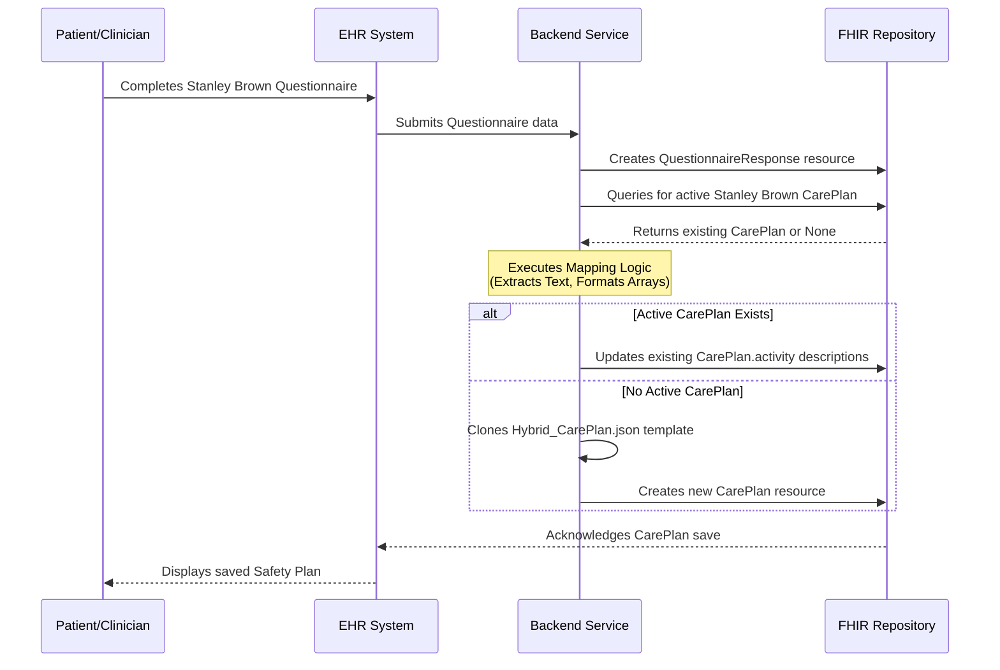

# Stanley Brown Data Mapping Guide

This document defines the "wiring" between the Stanley Brown FHIR `Questionnaire` (the data capture tool) and the `Hybrid_CarePlan` (the persistence model). 

It explains exactly how an EHR should extract answers from a submitted `QuestionnaireResponse` and map them into the `CarePlan` so that the safety plan is accessible and interoperable.

## The "Hybrid" CarePlan Approach
The `Hybrid_CarePlan.json` relies on duplicating textual data from the patient's answers directly into the `CarePlan.activity.detail.description` fields. While FHIR technically allows a CarePlan to simply reference a resulting `QuestionnaireResponse`, doing so means the receiving system *must* be capable of resolving that reference to actually read the safety plan. 

By embedding the text into the `activity` array, any standard EHR can immediately display the patient's coping strategies and emergency contacts without needing to perform secondary lookups.

## Field Mapping Table

The following table dictates how fields from the `Stanley_Brown_FHIR_Questionnaire` should be extracted and concatenated to form the `CarePlan` activity descriptions.

| Clinical Step | Questionnaire `linkId` | Target `CarePlan` Element | Formatting Logic (Example) |
| :--- | :--- | :--- | :--- |
| **Step 1: Warning Signs** | `1-1-warning-sign` | `activity[0].detail.description` | Comma-separated list: `"Thinking I am a burden, pacing, isolating myself"` |
| **Step 2: Internal Coping** | `2-1-coping-strategy` | `activity[1].detail.description` | Comma-separated list: `"Walking the dog, listening to music, playing guitar"` |
| **Step 3: Distraction Contacts**| `3-1-name-place` `3-2-contact-info` | `activity[2].detail.description` | Formatted pairs: `"Coffee shop (Main St), John Doe (555-0100)"` |
| **Step 4: Crisis Support** | `4-1-name` `4-2-contact-info` | `activity[3].detail.description` | Formatted pairs: `"Jane Doe (555-0101), Dr. Smith (555-0102)"` |
| **Step 5: Professionals** | `5-1-name` `5-2-contact-info` `5-3-name` `5-4-address` `5-5-phone` | `activity[4].detail.description` | Combine clinician and ED info: `"Dr. Jones (555-0103) / Unity Hospital ED (123 Main St, 555-9999)"` |
| **Step 6: Lethal Means** | `6-1-safety-action` | `activity[5].detail.description` | Comma-separated list: `"Guns locked in safe, keys given to brother"` |
| **Step 7: Reason for Living** | `7-1-worth-living` | `activity[6].detail.description` | Direct text: `"My daughter's graduation"` |

## Implementation Workflow

1.  **Form Submission:** The patient or clinician completes the Stanley Brown `Questionnaire`.
2.  **Resource Generation:** The EHR generates a FHIR `QuestionnaireResponse`.
3.  **Data Extraction:** A backend service or integration engine runs the mapping logic defined above.
4.  **CarePlan Creation/Update:** 
    *   If no active Safety Plan exists, generate a new `CarePlan` using `Hybrid_CarePlan.json` as the template. Populate the `activity.detail.description` strings.
    *   If an active Safety Plan *does* exist, update the existing `CarePlan` with the new strings (or create a new version of the resource).
5.  **Persistence:** Store the `CarePlan` for long-term retrieval and cross-network sharing.

### Sequence Diagram

---
*Created: 2026-02-23*
